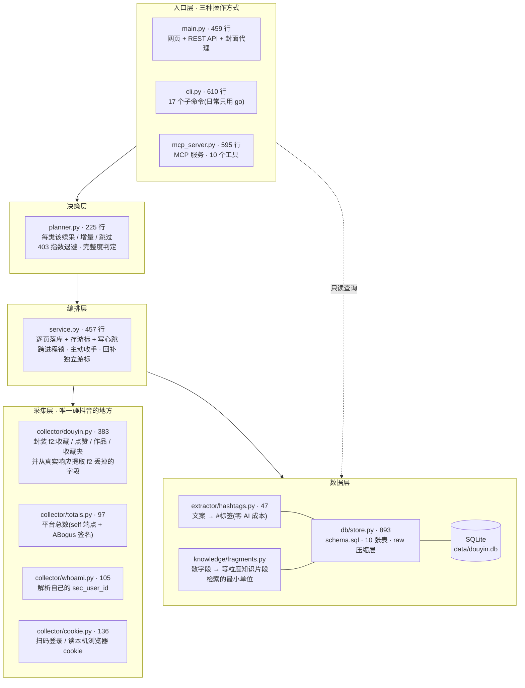
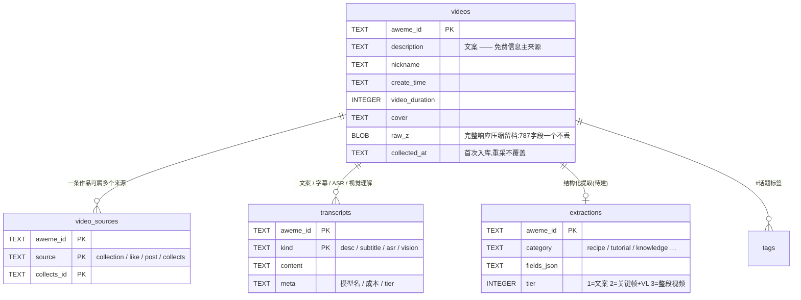
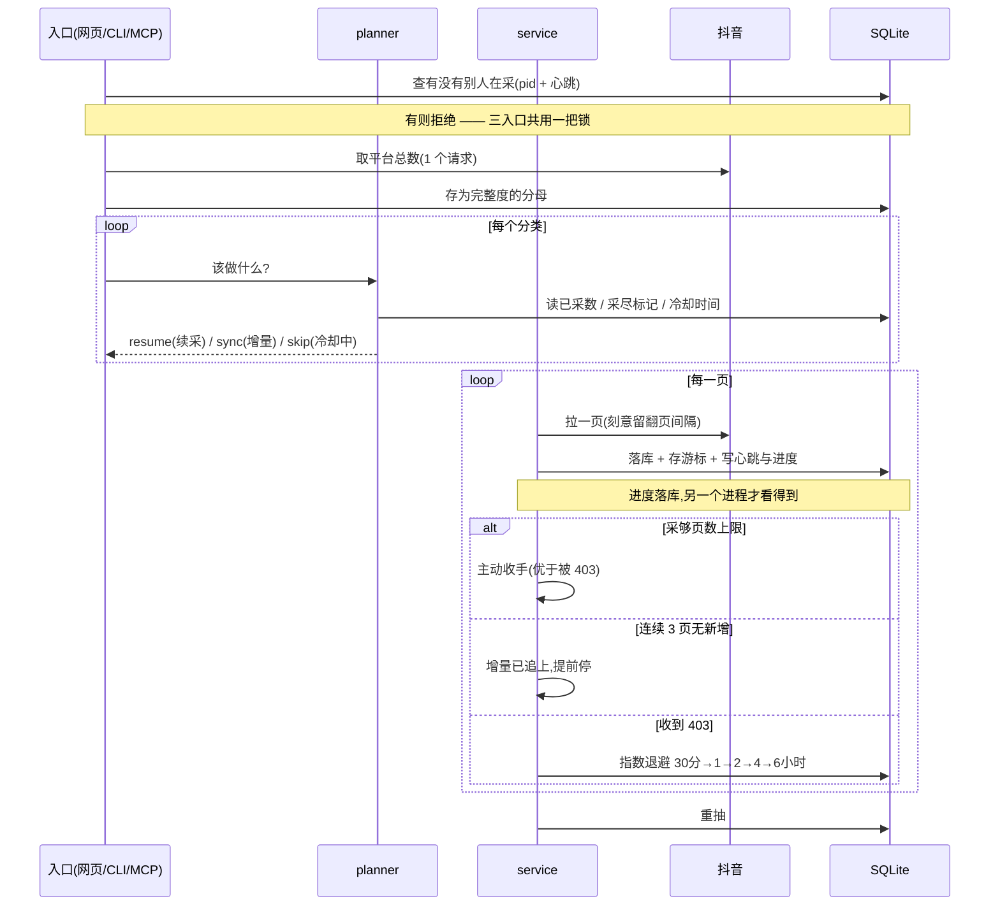

# 架构

后端 6583 行 + 前端 1037 行(单文件、零构建)。

## 分层

三个入口共用同一套逻辑、同一个数据库、同一把跨进程锁。任何一个入口在采集时,
另两个都会被拦住 —— 两个进程同时打抖音接口是风控的头号诱因。

**依赖方向是单向的**(复查过,没有反向依赖):

```
collector → config                    只碰抖音,不认识库
db/store  → config                    只碰库,不认识抖音
planner   → db                        只读状态做决策
service   → collector + db + config   唯一同时认识两边的地方
入口三件  → service (+ db 只读)
```

**唯一允许绕过 service 直接翻页的地方:没有。** `cli.py probe` 曾是个漏洞 ——
它不写库但照样在打抖音接口,却没过锁;复查时补上了 `guard_single_run()`。
其余直连 collector 的调用(扫码登录 / 解析 sec_user_id / 取平台计数)都是
单请求、不翻页,不需要上锁 —— 而扫码登录**必须**能在采集期间用,
因为 cookie 过期时正是要重登的时候。



## 数据模型



另外四张运行时表:

| 表 | 作用 |
|---|---|
| `cursors` | 每类的深挖游标,逐页推进,中断可续 |
| `collect_runs` | 采集记录,**兼作跨进程锁**(`pid` + `heartbeat_at` + `progress`) |
| `collect_state` | 采尽标记、退避级数、平台总数 —— 智能采集的记忆 |
| `collects_folders` | 收藏夹清单 |

## 一次采集的流程



## 关键设计决策

### 1. 只读,绝不写

不发评论、不点赞、不关注。批量写操作是封号主因。

这也是**否掉「在评论区 @AI 让它总结视频」那条路**的原因 —— 那需要对每个视频
自动发一条评论,500 个收藏就是 500 条自动评论,账号基本必挂。改为直接调
官方视频理解 API。

### 2. 中断必须无损

逐页落库 + 逐页存游标,而不是全拉完再存。403、断网、Ctrl+C 都不丢数据。
`raw_z` 存**完整响应**(787 个字段,zlib 压缩),以后要补字段**不必重采** ——
重采才是风控风险。这一点已经兑现过一次:官方分类 / AI 总结 / 章节大纲三个提取器
是后来才写的,靠 `scripts/reproject.py` 遍历本地 raw 就补齐了 1400 条,零网络请求。

### 3. 宁可少采,不撞 403

每类有单次页数上限,采够就主动停。这条来自实测:

| 翻页间隔 | 撑了多久 |
|---|---|
| 8 秒 | 55 页 · 1106 条 |
| 15 秒 | **14 页 · 272 条** |

**调大间隔并不能换来更深** —— 更像是接口对「往历史深处翻」有累计配额。
所以对策是主动收手,而不是放慢猛试。被拒之后的冷却代价远高于自己少采几页。

### 4. 完整度必须有分母

只靠「生成器自然结束」推断采尽是**不可靠的** —— 403 打断后续采时抖音会返回
`has_more=false`,生成器同样自然结束。实测因此误判过两次:点赞与收藏都被标成
「已采尽」,而拉到官方计数后发现各差 400+ 和 250+ 条(合计约 18–22%)。
在有分母之前,这个错误没有任何东西能纠正它。

> 具体数字随时在变(你每收藏一条分母就 +1),所以文档不写死。
> 跑 `cli.py state` 看实时值。

三个分母都在 `/aweme/v1/web/user/profile/self/`:
`aweme_count`、`favoriting_count`、以及藏在独立子对象里的
`user_collect_count.collect_count_list[item_type=2].collect_count`。
该端点**必须带 ABogus 签名**,裸请求即使 cookie 正确也返回「用户未登录」。

缺口也不都是漏采:原作者删稿 / 设私密 / 账号注销后列表就拉不到,但计数器还
算着。所以完整走完一遍仍有缺口时,只再确认两遍就接受现状 —— 否则会为永远
补不上的差额无限重采。

### 5. sync 与 resume 用各自的游标

游标记录「历史翻到哪了」,只属于 resume。sync 从最新扫,**绝不能碰它** ——
否则会把深挖进度覆盖成「最新往下 3 页」。这个 bug 实际发生过:收藏游标被
重置到 2026-01(而库里最早的收藏在 2020 年),续采白抓 895 条零新增,
还白担一次 403。

### 6. 锁必须落库

`asyncio.Lock` 只在单进程内有效。命令行与网页是两个进程,实测命令行在采时点
网页按钮会**直接放行**,两个进程一起打抖音。现在以数据库为准:
`collect_runs` 里有 `status='running'` 且 pid 存活、心跳新鲜的记录即视为在采。
进程崩溃留下的僵尸记录会被标为 `stale` 回收,否则那把锁会永久卡住。

### 7. 封面必须服务端代理 + 本地缓存

两个原因缺一不可:

- **防盗链** — 抖音 CDN 要 `Referer: https://www.douyin.com/`,浏览器直连拿不到
- **URL 会过期** — 所有封面 URL 都带 `x-expires` 签名,不落本地迟早全失效

### 8. 前端不用框架

707 行单 HTML,FastAPI 直接托管,零构建步骤。自部署工具多一条 Node 工具链
就多一道门槛,用户一个端口跑完。API 是干净分离的,以后想换随时能换。

视觉上按数据性质定档(参考 taste-skill 的三个旋钮):
密度 8(2500+ 条的驾驶舱,用 1px 分隔线而非卡片盒子)、
变化度 3(工具要可扫描,规整优于不对称)、动效 3(只做功能性反馈)。

## 大模型分析层怎么接

结构已经留好,**不用改表**:

```
现在   transcripts(kind='desc',  tier=1)  ← 抖音自带文案,零成本,覆盖 98%
以后   transcripts(kind='vision', tier=2) ← 关键帧 + 视觉模型,补那 2% 无文案的
       extractions(category, fields_json) ← 按类型结构化:菜谱→食材/步骤
```

三档降级是成本控制的核心:

| 档 | 触发 | 成本 |
|---|---|---|
| ① 文案直用 | 抖音自带文案够用 | 免费 |
| ② 关键帧 + 视觉模型 | 文案不足 | 低(3-5 帧远小于整段视频) |
| ③ 整段视频理解 | 用户标记的重点 | 高,按需 |

`pipeline/` 与 `search/` 目录是空占位,分别留给「视频 → 文本」管线和
「向量检索 + 问答」。


---

## 复查记录

每次阶段收尾都实跑一遍下面这些,而不是靠上一轮的结论 —— 改名和改索引的
坑都是这么抓到的。

### 抓到过的真问题

| 问题 | 根因 | 为什么容易漏 |
|---|---|---|
| MCP `library_stats` 直接 KeyError | `stats()` 把 `with_ai_summary` 改成三态时,MCP 那一处没跟着改 | 我验证 MCP 是在改名**之前**跑的,改完没重跑 |
| `ALTER TABLE DROP COLUMN` 报 `error in index ... after drop column` | 索引从 A 列改到 B 列,但 `CREATE INDEX IF NOT EXISTS` 只看名字 —— 老索引静默留在旧列上 | 报错信息完全看不出根因在索引上 |
| 新采的作品没有知识片段 | 片段只在脚本里生成,没接进 `_persist_page` | 不报错、不提示,只是检索里查不到 |
| `cli.py probe` 绕过跨进程锁 | 它不写库,但照样在打抖音接口 | 「不写库」让人以为无害 |
| 两个字段表达同一件事 | `has_ai_summary` 和 `content_state` 并存 | 布尔表达不了「还不知道」,留着必然被误用 → 已删列 |

### 每轮必跑的检查

```bash
# 1. 改名后有没有漏改的调用点(会直接 KeyError)
grep -rn "旧字段名" backend/ scripts/

# 2. 三个入口对同一条件是否返回同样的数
#    网页 / cli / MCP 各查一次,数字必须相等

# 3. 数据完整性(全量,不抽样)
#    完整 raw 无缺 · 三态取值合法 · have 与 transcripts 双向一致
#    片段无孤儿 · n_chars 与实际一致 · 章节段都有时间戳

# 4. 全新空库跑 init_db 三遍
#    表数/列数对 · 已删的列不该出现 · 幂等无报错

# 5. 干净克隆跑 setup.sh
#    pip check 干净 · f2 的钉子(httpx 0.27.2 / pydantic 2.9.*)没被下游破坏
```

### 分层纪律

依赖单向,无反向依赖:

```
collector → config          只碰抖音,不认识库
db/store  → config          只碰库,不认识抖音
planner   → db              只读状态做决策
knowledge → 无              纯函数,散字段 → 片段
service   → collector + db  唯一同时认识两边的地方
入口三件  → service(+ db 只读)
```

**任何会打抖音接口的路径都必须过 `guard_single_run()`**,包括不写库的
(probe 就是反例)。单请求且不翻页的除外:扫码登录 / 解析 sec_user_id /
取平台计数 —— 而扫码登录必须能在采集期间用,cookie 过期时正是要重登的时候。
